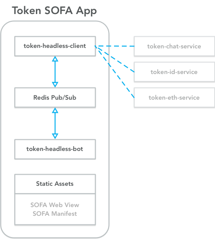

# Token SOFA App

This repository provides a sample app that you can fork and deploy in as little as 5 minutes.

See [this guide to creating a Token app](http://developers.tokenbrowser.com/docs/creating-a-token-app) to get started.

## Architecture

This bot has a Redis backend for storage. It converts your standard messages into SOFA messages, and then encrypts them to use the Signal protocol for end-to-end encryption.

The bot logic is contained in the [`bot/src/bot.js`](https://github.com/tokenbrowser/token-sofa-app/blob/master/bot/src/bot.js) file. Start editing here to change the logic.

## See also

See [https://www.tokenbrowser.com]

Heroku deploy work-in-progress:

